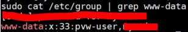
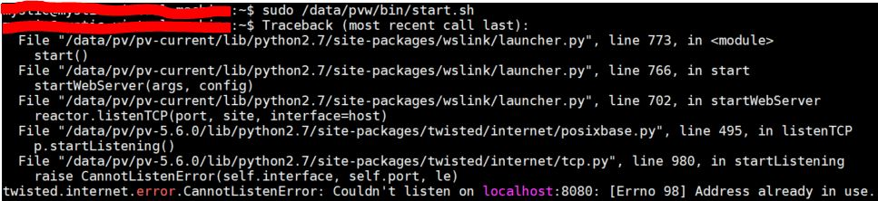
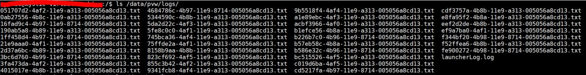
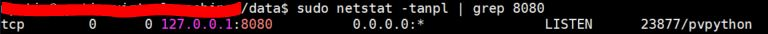
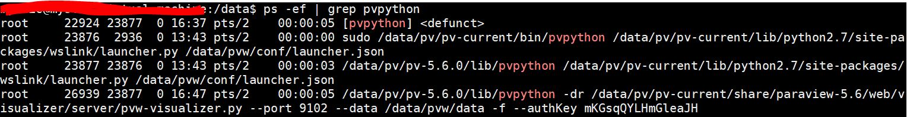
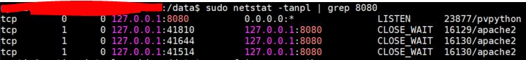
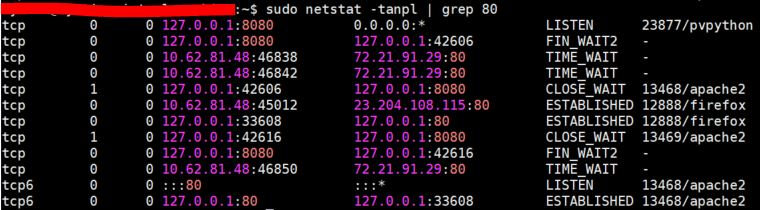
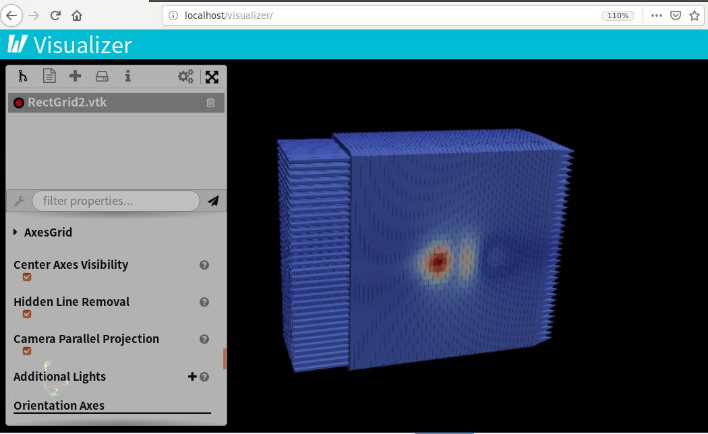

# Paraviewweb 5.6 on Ubuntu 18.04 LTS

## Package installation

--Based on [https://kitware.github.io/paraviewweb/docs/ubuntu\_14\_04.html](https://kitware.github.io/paraviewweb/docs/ubuntu_14_04.html)

Once you’ve properly installed your new Unbuntu Desktop you may want to add all the missing libraries and dependencies.

```
$ sudo apt-get update
$ sudo apt-get upgrade
$ sudo apt-get install \
    apache2-dev apache2 libapr1-dev apache2-utils        # Apache Web Server
    nvidia-current mesa-common-dev libxt-dev             # OpenGL drivers
    build-essential python2.7-dev cmake-curses-gui       # (Optional) Needed if you want to build ParaView
    ssh wget emacs                                       # (Optional) Useful tools
```


Apache2 here is used to provide proxy which httpd/Ngnix also support 


If you are using Ubuntu Server, you should also install kde to make sure you have a graphics environment:

```text
$ sudo apt-get install kde-full
```

In order to properly install the NVidia drivers, you will need to execute the following command line and restart:

```text
$ sudo nvidia-xconfig

# => Reboot

$ sudo nvidia-settings

# => Make sure your screen and GPU has been properly detected.

```

## ParaViewWeb user creation

Unless you have your own launcher application that will take care of who is running the visualization process based on your SSO system, you may want to simply use the process launcher that comes with ParaView. And if you do so, you might not want that process to run under your ‘powerful’ user.

```
# Create a new user
$ adduser pvw-user

# Add that user to the apache user group
$ usermod -a -G www-data pvw-user
```

Check user group




www-data is default user group of Apache 


Then you should make sure that this user will auto login in the graphical environment. This will allow ParaViewWeb to properly use your GPU.

## Setting up the directory structure for later

The path provided below are just an example on how to structure the different pieces that will be needed for your web server. But by defining them here it is easier to reference them later on. In the proposed structure, everything will be nested underneath the /data directory. So let’s create those directories.

```text
$ sudo mkdir -p /data/pvw /data/pv /data/logs /data/www
```

Directory structure:

* /data/www will contains the html/js/css files that compose your web site that will leverage ParaViewWeb.
* /data/pv will contains the ParaView installation binaries.
* /data/pvw will contains the ParaView process launcher that will dynamically trigger a new process for each visualization session.
* /data/logs will contains the Apache logs that will serve your ParaViewWeb virtual host.

## Installation of ParaViewWeb

ParaView which contains ParaViewWeb is available for download [here](http://www.paraview.org/paraview/resources/software.php).  
And you can even take the latest version that was build on the master branch of ParaView which is supposed to be stable.  
If you want to build ParaView yourself, you can refer to the Wiki [here](http://paraview.org/Wiki/ParaView).

In any case, you should have a directory structure that looks like that:

```text
-> paraview-5.6
    + bin
      - pvpython
      - pvserver
      - ...
    + lib
      + paraview-5.6
        - libvtkXXXX.so
      + python2.7
        + site-packages
          + paraview
          + vtkmodules
          + wslink
          + ...
    + share
      + paraview-5.6
        + web
          + visualizer
            + www
              - index.html
              - ...
            + server
              - pvw-visualizer.py
          + lightviz
            + www
            + server
```


There is no vtk in Paraview-5.6 but vtkmodules, and **wslink** includes "**launcher.py**" which is the one called in **start.sh**


Let’s copy it in our global directory structure and assign it to our ParaViewWeb user:

```text
$ sudo cp -r /.../paraview-xxx /data/pv/pv-5.6.0
$ sudo ln -s /data/pv/pv-5.6.0 /data/pv/pv-current
$ sudo chown -R pvw-user /data/pv
$ sudo chgrp -R pvw-user /data/pv
```

## Configuration of ParaViewWeb launcher

We’ve already created the /data/pvw directory to embed the ParaView Process Launcher with its configuration. Let’s structure the content of that directory.

```text
$ sudo mkdir -p /data/pvw/bin /data/pvw/conf /data/pvw/data /data/pvw/logs
```

When you edit the configuration file **launcher.json**, shown below, you can use **localhost** in **"**sessionURL" or your actual hostname.



```text
  {
    "resources": [ {"port_range": [9001, 9103], "host": "localhost"} ],
    "sessionData": {
      "updir": "/Home"
    },
    "configuration": {
      "log_dir": "/data/pvw/logs",
      "host": "localhost",
      "endpoint": "paraview",
      "sessionURL": "ws://localhost/proxy?sessionId=${id}&path=ws",
      "timeout": 25,
      "upload_dir": "/data/pvw/upload",
      "fields": ["file", "host", "port", "updir"],
      "port": 8080,
      "proxy_file": "/data/proxy.txt"
    },
    "properties": {
      "web_path": "/data/pv/pv-current/share/paraview-5.6/web",
      "dataDir": "/data/pvw/data",
      "python_exec": "/data/pv/pv-current/bin/pvpython"
    },
    "apps": {
      "visualizer": {
        "cmd": [
          "${python_exec}", 
          "-dr", 
          "${web_path}/visualizer/server/pvw-visualizer.py",
          "--port", "${port}", 
          "--data", "${dataDir}", 
          "-f", 
          "--authKey", "${secret}"
        ],
        "ready_line" : "Starting factory"
      },
      "lightviz": {
        "cmd": [
          "${python_exec}", 
          "-dr", 
          "${web_path}/lightviz/server/pvw-light-viz.py",
          "--port", "${port}", 
          "--data", "${dataDir}", 
          "-f", 
          "--authKey", "${secret}"
        ],
        "ready_line" : "Starting factory"
      }
    }
  }
```



When you edit/create the **start.sh** file, shown below, be sure  **export DISPLAY=:0.0** works in your Ubuntu, otherwise there will be **bad X server connection. DISPLAY=:0.0. Aborting,** and When you run [http://localhost/visualizer/](http://shailesh-office/visualizer/) in your web browser,  you can see an error _**"Session did not start before timeout expired"**_ .



```text
  #!/bin/bash

  export DISPLAY=:0.0
  /data/pv/pv-current/bin/pvpython /data/pv/pv-current/lib/python2.7/site-packages/wslink/launcher.py /data/pvw/conf/launcher.json &
```




If X server doesn't work, then do **\#export DISPLAY=:0.0.** Another hint is to make sure path of **launcher.py** is correct if you use other Paraviewweb version 


Create proxy.txt file and assign user/group and permission

```text
$ sudo touch /data/proxy.txt
$ sudo chown pvw-user /data/proxy.txt
$ sudo chgrp www-data /data/proxy.txt
$ sudo chmod 660 /data/proxy.txt
```

Add ParaView Data as sample data to visualize

```text
$ wget http://paraview.org/files/v4.0/ParaViewData-v4.0.1.tar.gz
$ tar zxvf ParaViewData-v4.0.1.tar.gz
$ sudo cp -r ParaViewData-v4.0.1/Data/* /data/pvw/data
```

Change the security rights to the directory content

```text
$ sudo chown -R pvw-user /data/pvw
$ sudo chgrp -R pvw-user /data/pvw
$ sudo chmod u+x /data/pvw/bin/start.sh
```

Then, you need the user pvw-user to execute **/data/pvw/bin/start.sh** when it is properly logged in with its display setup…Successful running start should not be any error, otherwise you would see info presented like this:




Error information of start.sh \(pvpython/launcher.py\) cloud be found in **/data/pvw/logs**




If launcher run up, you would find 8080 port is LISTEN status



## Configuring Apache

> #### Introduction <a id="Introduction-1"></a>
>
> Apache will act as our front-end webserver. This means that both the HTML content and the WebSocket forwarding will be handled by Apache.

## Configuration

First of all, you will need to enable the modules that will be used by our ParaViewWeb virtual host.

```text
$ sudo a2enmod vhost_alias
$ sudo a2enmod proxy
$ sudo a2enmod proxy_http
$ sudo a2enmod proxy_wstunnel
$ sudo a2enmod rewrite
```

 Then lets create our virtual host. Be sure to replace **localhost** , shown in the example below, with your actual host name. Also include a real email address in place of **`YOUR_EMAIL@COMPANY.COM`**.



```text
<VirtualHost *:80>
    ServerName localhost
    ServerAdmin YOUR_EMAIL@COMPANY.COM
    DocumentRoot /data/www
    ErrorLog /data/logs/error.log
    CustomLog /data/logs/access.log combined

    ### The following commented lines could be useful when running
    ### over https and wss:
    # SSLEngine On
    # SSLCertificateFile    /etc/apache2/ssl/your_certificate.crt
    # SSLCertificateKeyFile /etc/apache2/ssl/your_domain_key.key
    # SSLCertificateChainFile /etc/apache2/ssl/DigiCertCA.crt
    #
    # <Location ${MY-DOCUMENT-ROOT} >
    #   SSLRequireSSL On
    #   SSLVerifyClient optional
    #   SSLVerifyDepth 1
    #   SSLOptions +StdEnvVars +StrictRequire
    # </Location>

    # Rule for ParaViewWeb launcher
    ProxyPass /paraview http://localhost:8080/paraview
    #ProxyPassReverse /paraview http://localhost:8080/paraview

    # Rewrite setup for ParaViewWeb
    RewriteEngine On

    # This is the path the mapping file Jetty creates
    RewriteMap session-to-port txt:/data/proxy.txt

    # This is the rewrite condition. Look for anything with a sessionId= in the query part of the URL and capture the value to use below.
    RewriteCond %{QUERY_STRING}     ^sessionId=(.*)&path=(.*)$ [NC]

    # This does the rewrite using the mapping file and the sessionId
    RewriteRule    ^/proxy.*$  ws://${session-to-port:%1}/%2  [P]

    <Directory "/data/www">
        Options Indexes FollowSymLinks
        Order allow,deny
        Allow from all
        AllowOverride None
        Require all granted
    </Directory>

</VirtualHost>
```



Then enable that virtual host and restart Apache

```text
$ sudo a2ensite 001-pvw.conf
$ sudo service apache2 restart
```

If you run into problems with your new virtual host listening properly, you may need to disable the default virtual hosts file as follows:

```text
$ sudo a2dissite 000-default.conf
```


Here also can choose another way to avoid 80 port conflict with ****_**Apache2 Ubuntu Default Page**_ , assign different ports to them because Apache support vary Web Apps work at same time, as following:


```text
sudo vim /etc/apache2/ports.conf
```

Add **Listen 81** in the **ports.conf** of apache2 for _**Apache2 Ubuntu Default Page**_ **:**

```text
# If you just change the port or add more ports here, you will likely also
# have to change the VirtualHost statement in
# /etc/apache2/sites-enabled/000-default.conf

Listen 80
Listen 81
<IfModule ssl_module>
        Listen 443
</IfModule>

<IfModule mod_gnutls.c>
        Listen 443
</IfModule>
```

Replace 80 with 81 in 000-default.conf

```text
sudo vi  /etc/apache2/sites-available/000-default.conf
```

```text
<VirtualHost *:81>
        # The ServerName directive sets the request scheme, hostname and port that
        # the server uses to identify itself. This is used when creating
        # redirection URLs. In the context of virtual hosts, the ServerName
        # specifies what hostname must appear in the request's Host: header to
        # match this virtual host. For the default virtual host (this file) this
        # value is not decisive as it is used as a last resort host regardless.
        # However, you must set it for any further virtual host explicitly.
        #ServerName www.example.com

        ServerAdmin webmaster@localhost
        DocumentRoot /var/www/html

        # Available loglevels: trace8, ..., trace1, debug, info, notice, warn,
        # error, crit, alert, emerg.
        # It is also possible to configure the loglevel for particular
        # modules, e.g.
        #LogLevel info ssl:warn

        ErrorLog ${APACHE_LOG_DIR}/error.log
        CustomLog ${APACHE_LOG_DIR}/access.log combined

        # For most configuration files from conf-available/, which are
        # enabled or disabled at a global level, it is possible to
        # include a line for only one particular virtual host. For example the
        # following line enables the CGI configuration for this host only
        # after it has been globally disabled with "a2disconf".
        #Include conf-available/serve-cgi-bin.conf
</VirtualHost>
```

## Setting up the ParaViewWeb Web Site

You just need to copy the various web applications to our served directory.

```text
Visualizer
$ cd /data/pv/pv-5.2/share/paraview-5.2/web
$ sudo cp -r visualizer/www /data/www/visualizer

=> http://YOUR_HOST_NAME_TO_REPLACE/visualizer
```

```text
LightViz
$ cd /data/pv/pv-5.2/share/paraview-5.2/web
$ sudo cp -r lightviz/www /data/www/lightviz

=> http://YOUR_HOST_NAME_TO_REPLACE/lightviz
```

You may need to ensure proper rights for the /data/www directory

```text
$ sudo chown -R www-data:www-data /data/www
```

## Successful running up status of ParaViewWeb 









